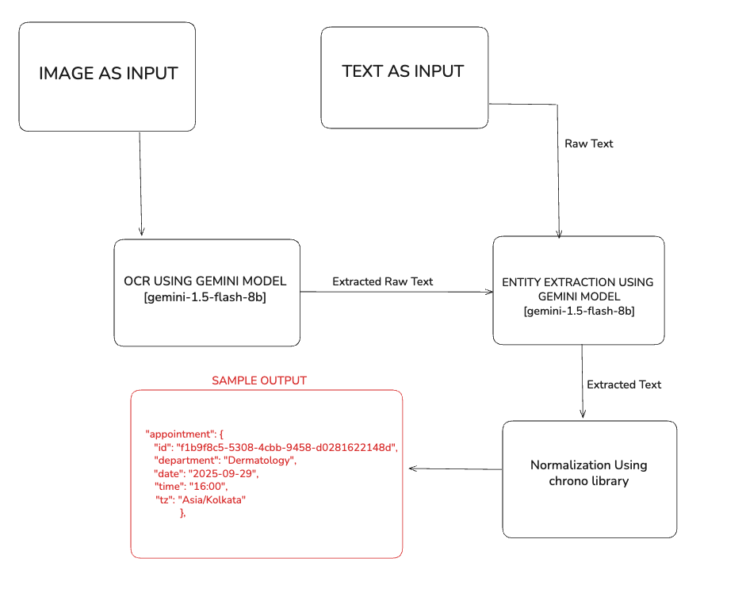

AI-Powered Appointment Scheduler Assistant

Backend service exposing `/schedule` to parse text or images into structured appointment JSON using Gemini (OCR + NLU) with guardrails and normalization to `Asia/Kolkata`.

## System Architecture



Setup

1. Install dependencies:

```bash
npm install
```

2. Create `.env` in project root:

```bash
# .env
GOOGLE_GENAI_API_KEY=YOUR_API_KEY
GEMINI_MODEL=gemini-1.5-flash-8b
PORT=3000
```

3. Start server:

```bash
npm start
```

Endpoint

POST `/schedule`

- Accepts either JSON body with `text` or `raw_text`, or `multipart/form-data` with an `image` file field.
- Returns stepwise outputs and final appointment JSON, or guardrail message when ambiguous/blurred.

JSON Text Example

```bash
curl -X POST http://localhost:3000/schedule \
  -H 'Content-Type: application/json' \
  -d '{"text":"Book dentist next Friday at 3pm"}'
```

Image Example

```bash
curl -X POST http://localhost:3000/schedule \
  -H 'Content-Type: multipart/form-data' \
  -F image=@/path/to/note.jpg
```

Responses

- If image is blurry:

```json
{
  "status": "needs_clarification",
  "message": "Image appears blurry or low quality. Please upload a clearer photo or provide the text.",
  "override_suggestion": "Please upload a clearer image",
  "ocr_confidence": 0.42
}
```

- Success example (schema):

```json
{
  "step1": { "raw_text": "...", "confidence": 0.9 },
  "step2": {
    "entities": {
      "date_phrase": "next Friday",
      "time_phrase": "3pm",
      "department": "dentist"
    },
    "entities_confidence": 0.85
  },
  "step3": {
    "normalized": {
      "date": "2025-09-26",
      "time": "15:00",
      "tz": "Asia/Kolkata",
      "department_formal": "Dentistry"
    },
    "normalization_confidence": 0.9
  },
  "appointment": {
    "department": "Dentistry",
    "date": "2025-09-26",
    "time": "15:00",
    "tz": "Asia/Kolkata"
  },
  "status": "ok"
}
```

Notes

- Requires Gemini API key in `GOOGLE_GENAI_API_KEY` (or `GEMINI_API_KEY`).
- Uses `gemini-1.5-flash` for speed. You can switch the model in `src/services/gemini.js`.
- Date/time normalization uses `chrono-node` and `luxon` in `Asia/Kolkata` timezone.
